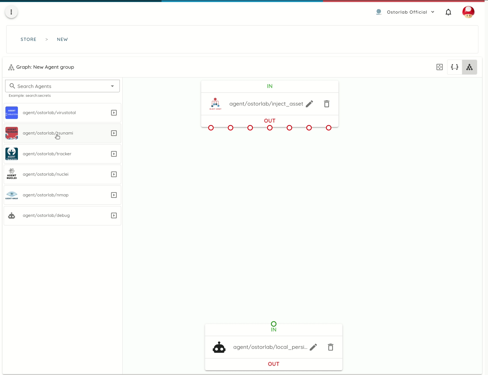
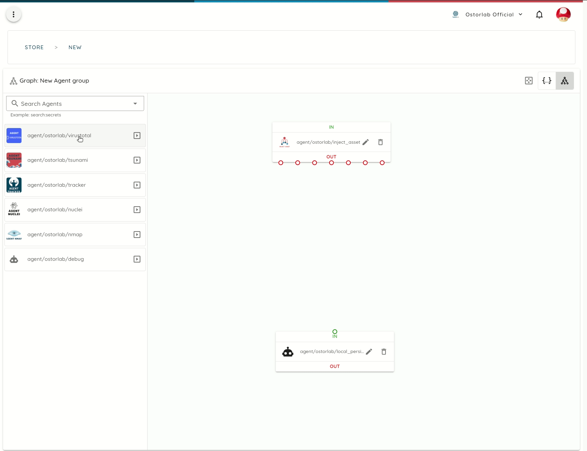

[](https://badge.fury.io/py/ostorlab)
[](https://pepy.tech/project/ostorlab)
[](https://blog.ostorlab.co/)
[](https://twitter.com/ostorlabsec)

# Ostorlab Open-Source Security Scanner


## The Sales Pitch

If this is the first time you are visiting the Ostorlab Github page, here is the sales pitch.

Security testing requires often chaining tools together, taking the output from one, mangling it, filtering it and then
pushing it to another tool. Several tools have tried to make the process less painful with limited success. Ostorlab addresses the same
challenge by simplifying the hardest part and automating the boring and tedious part.

To do that, Ostorlab focuses on the following:

* __Ease of use__ with simple one command-line to perform all tasks
* __Developer Experience__ through project documentation, tutorials, SDK and templates
* __Scalability and Performance__ by using efficient serialisation format and proven industry standard for all of its components


To do that, Ostorlab ships with:

* A simple, yet powerful SDK to make simple cases effortless while supporting the complex one, like distributed locking,
  QPS limiting, multiple instance parallelization ...
* A battle-tested framework that has been powering Ostorlab Platform for years and used to perform complex dynamic
  analysis setup and demanding static analysis workloads running on multiple machines.
* Performant and scalable design, thanks to the use of message queue with dynamic routing, binary and compact message
  serialisation with protbuf, universal file format using docker image, resilient thanks to docker swarm mode to cite a
  few
* A store of agents that make is to use and discover tools to add your toolset
* An automated builder to take the hassle away of building and publishing.
* A GUI to prepare and write down your tool collection setup
* Focus on documentation, multiple tutorials and upcoming videos and conference presentations
* A ready to use one-click template repo to get started.

# Requirements

For some tasks, like running scans locally, Docker is required. To install docker, please see the following
[instructions](https://docs.docker.com/get-docker/).

# Installing

Ostorlab is shipped as a Python package on Pypi. To install, simply run the following command if you have `pip` already
installed.

```shell
pip install -U ostorlab
```

# Getting Started

To perform your first scan, simply run the following command:

```shell
ostorlab scan run --install --agent agent/ostorlab/nmap --agent agent/ostorlab/openvas --agent agent/ostorlab/tsunami --agent agent/ostorlab/nuclei ip 8.8.8.8
```

This command will download and install the following scanning agents:

* `agent/ostorlab/nmap`
* `agent/ostorlab/tsunami`
* `agent/ostorlab/nuclei`
* `agent/ostorlab/openvas`

And will scan the target IP address `8.8.8.8`

To check the scan status:

```shell
ostrlab scan list
```

Once the scan has completed, to access the scan results:

```shell
ostorlab vulnz list --scan-id <scan-id>
ostorlab vulnz describe --vuln-id <vuln-id>
```

# The Store

Ostorlab lists all agents on a public store where you can search and also publish your own agents.


In addition, the store, a graphical agent group builder is also available to compose multiple agents and see how
they would interact with each other.



The builder also helps with generating the agent group YAML file to set special arguments that can be passed to agents
to control their behavior.



# Publish your first Agent

To write your first agent, check out the full tutorial [here](https://docs.ostorlab.co/tutorials/write-an-ostorlab-agent/).

Once you have written your agent, you can publish it on the store for others to use and discover it. The store even
handles agent building and will automatically pick up new releases from the git repo.


